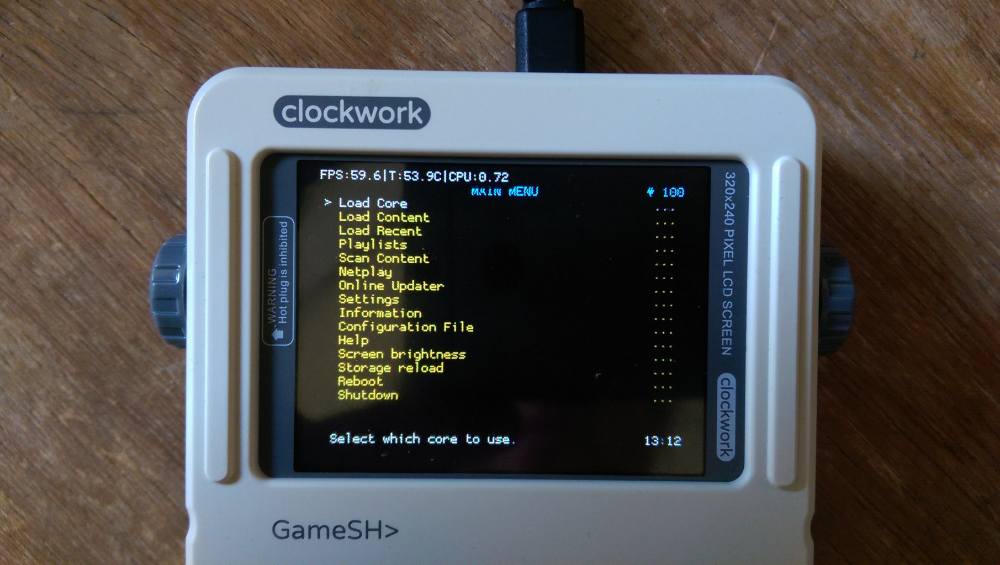

# Customized RetroArch for clockworkpi 

## Introduction

This customized version of RetroArch enables new features for using specifically with the 
clockworkpi GameShell.

The new features are:

* Wifi management.
* Bluetooth management.
* On-screen Keyboard working with the GameShell keypad.
* New on-screen hardware monitoring: Temperature, and cpu frequency.
* Brightness adjustment on main menu.
* Shutdown, and restart on main menu.
* ~~Battery monitoring~~ Now it works with vanilla RetroArch :)

## Screenshots



## Dependencies

````
apt install git build-essential libudev-dev libegl-dev libasound-dev libgbm-dev libdrm-dev libgles2-mesa-dev libavcodec-dev libavformat-dev libavdevice-dev libdbus-1-dev libpulse-dev
````
# Clone RetroArch
````
git clone https://github.com/libretro/RetroArch.git --depth=1 --branch=v1.9.0
````
# Apply the patch
````
cd ReroArch
cp ../cpi-retroarch-lakka-v1.9.0.patch .
git apply cpi-retroarch-lakka-v1.9.0.patch
````
# Configure, compile, install
````
CFLAGS=-mfpu=neon ./configure --enable-alsa --enable-udev --enable-floathard --enable-neon --enable-networking --enable-opengles --enable-egl --enable-kms --disable-x11 --disable-xmb --disable-ozone --disable-materialui --disable-vg --enable-ffmpeg --enable-pulse --disable-oss --disable-freetype --enable-7zip --enable-dbus --prefix=/usr
make -j4
make install
````
# Configuration

After running for the first time, two new options will be available in the `retroarch.cfg` config file:

````
temp_show = "true"
cpufreq_show = "true"
````
These options append the temperature, and fequency monitoring to the fps counter (`fps_show` option) when it is enabled. In the future I'll add it as an menu option.

The wifi menu is under `settings > wifi`

# Troubleshooting

* Wifi doesn't scan
   * Wifi menu seems to work only with menu widget enabled, so enable it in `settings > On-screen Display > On-Screen Notifications > Graphics Widgets`.
   * Try to go back in the menu, and return to the wifi menu.
   *  
